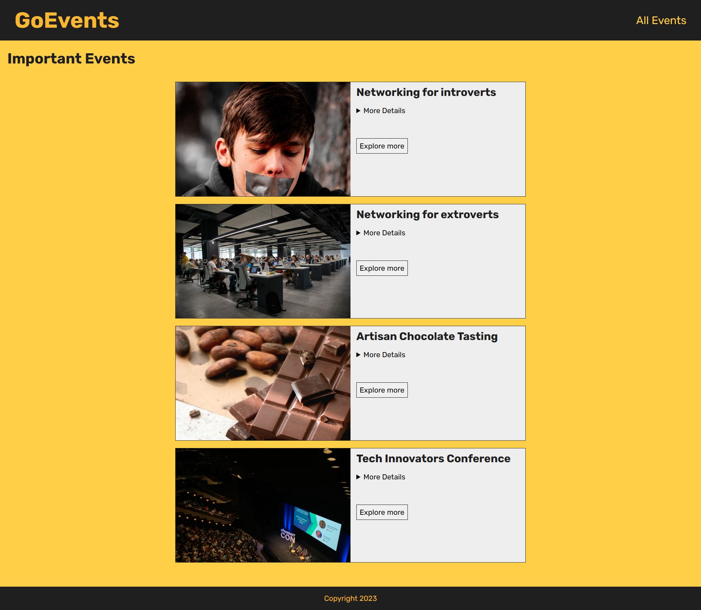
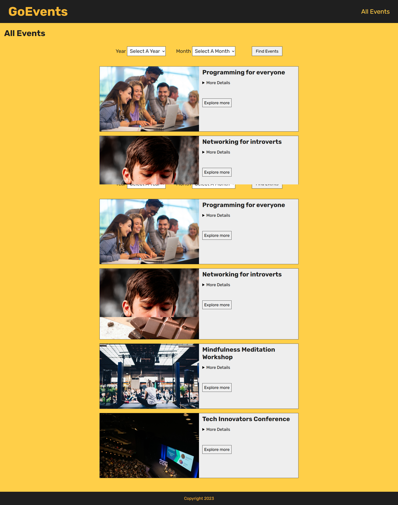

# Events APP

- This app is developed using Next.js. it is used to show the latest important events around the world.
- The app uses a dummy data which is some events with its information.
- It is a simple app with a purpose of improving **Next.js** skill.

## Features

- With **Next.js** the app now can render from the server instead of rendering in the client-side, and that's one of the most important features in **Next.js**.
- Using filter system to render filtered data.
- Easy navigation between pages.

## Tools

- Next.js
- React.js
- CSS - CSS3
- HTML - HTML5
- JavaScript

## Screenshots

---

## 🚀 About Me

Junior Front-end developer with a history of creating engaging, user-friendly websites with proven success. Developed modern websites with advanced features, showcasing technical excellence. Motivated to stay up-to-date with industry trends and best practices. Aspiring to be a Full-stack developer with a strong determination and passion for coding.

## 🛠 Skills

- HTML/HTML5
- CSS/CSS3
- JavaScript
- Object Oriented Programming (OOP)
- Sass\SCSS
- Pug
- GulpJs
- BootStrap
- Material UI
- React.js
- React ecosystems (React Router - React Redux - React Query)
- Redux - Redux Toolkit
- Firebase

## 🔗 Links

